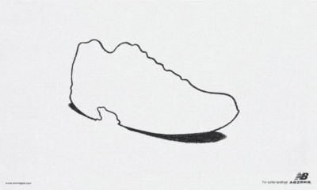

# Approach 

My approach is simple, it consisted in using a CLIP-ViT encoder to generate the embeddings for each image in the dataset, 
and then leveraging the qdrant_client library in order to query the populated collection with a text prompt.

I have used the sentence-transformers library as it provides a simple interface in order to encode both images and text.
To make my approach efficient, I decided to batch process the images through the encoder. 

For the text search, I have implemented a simple streamlit GUI which uses the same encoder as it did for the images and performs a cosine similarity search from qdrant to retrieve the closest matches in the database.

In order to make everything as convenient as possible for whoever would like to run this, I have also made bash scripts to contain all the installation and running code into single files.
The run_app.bash script opens two terminal windows, one hosting the qdrant docker image, and the other the streamlit application.
It also assumes you have installed python as a venv in the same repo as the project. Please change it to correspond to your python location if different.
## Challenges

* **Familiarizing myself with qdrant** This was a quick process and I loved how simple everything was to set up and actually use.

* **Scaling up**: Initially I worked with a toy dataset of around 100 images to get going, however, when I switched to the ad dataset, it became apparent that my approach was too slow. Both during inference and upserting.
I changed to batch processing which saved time both during the inference of the embeddings, as well as during the upsert, since upserting batches of 32 to the database is more foolproof than
upserting all the computed embeddings at once.

* **Score threshold**: The cosine distance between the prompts and the queries seem to lie most of the time in the 0.2-0.3 range of values. This makes it difficult to evaluate the performance of the approach as sometimes there are errors in this score range, sometimes there are correct retrievals in this range. There is no obvious cutoff like 0.5, a lot of the scores are compressed in this range.

## Qualitative evaluation
For a qualitative evaluation/test, I have prepared the following prompts which should yield accurate results:

* a woman holding a drink
* synthesizer
* spiral
* eyes
* chocolate ice cream

Sometimes there are easy prompts it gets wrong too:
* carrot
* submarine

The image retrieval does a pretty good job when faced with prompts that are pretty explicit and simple, common things.
However, when some degree of specificity is included, for instance:
* a man wearing a dress
* a dog swimming
* democrat party

It struggles to find good examples, and the highest scoring ones are usually not really accurate. Either one or the second part of the prompt is found, but not usually together and the ones where the two concepts are together have a similar score to the others.

Similarly, since a lot of the images contain text, the encoder often picks up on the text. So prompts like apple will yield a lot of 
ads for apple the company, that do not feature any apple fruit. I do not see this as an error but it is something important to know about the usefulness of the application.

There is also the issue of ambiguity, both in the text prompts and the images, some images. Some images, such as 

are pretty abstract and might show up on many different prompts as they lie in an interesting place in our embedding space.
I have had this picture show up for the prompt "circuit". Which I meant as a computer circuit but the system understood it as a racing circuit.

Sometimes the prompt tries finding something outside of the distribution of our dataset, and finds whatever is closest to the prompt semantically.
For *submarine*, it returns pictures of the sea but no actual sub.
For *carrot*, it finds pictures of a number of different vegetables.

## Quantitative Evaluation
Performing a quantitative evaluation of such a search algorithm seems tricky. One approach could be collecting a test dataset from the web with pairs of images and text, and trying to see if the encoded images are found by querying their exact associated text.
The system will definitely run into some of the problems we faced in the qualitative evaluation, but it would provide some numbers for the evaluation metrics.

Selecting an evaluation metric is difficult since this is not really a classification problem. Trying to formulate an evaluation method to fit a binary classification metric, i.e. correct vs incorrect retrievals, might lose some of the nuance needed.

### Annotation
**Without** additional data, I'd use a subsection of this dataset, and formulate some queries, while specifically labeling all the pictures that ought to show up in the results.
To label such a pair of prompts/images, I'd select a subsection of the dataset focused around a specific industry. I would then formulate 10 prompts, varied in complexity and specificity, and then build a quick annotator to label the pairs.
The labeling method would be: the annotator gets shown a picture, they select whichever prompts fit, if any, and then move on to the next image.

**With** additional data, I'd try using an object detector model, and auto label all the images with the yolo classes. When the object detector finds an item with high confidence, our prompt of that class ought to yield the picture in the results.
This would be easy to treat as a classification problem and would yield metrics that might allow us to improve the model.

What might not be captured is how well it does with out-of-domain prompts. Perhaps a visual QA model might also come in handy to generate some text/image pairs, but we might be propagating model errors in the evaluation with an external model.

## Avenues for improvement

* making use of the payload. could use an OCR model to extract all the text in the images and embed that text as well to do a multimodal search.
* different encoder, trained on more data
* bigger embedding size might capture the more abstract ads information more adequately - although higher dimensionality always has an effect on the distance of the points. 512 is already hard to interpret.
* feature engineering to add more interpretable features to the payload which might aid in a search.