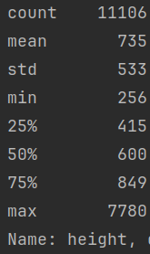
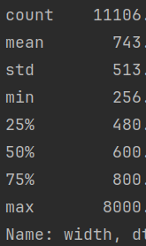

# Dataset Exploration

The provided `Advertisement Image Dataset` consists of `11106` images of various sizes, depicting advertisments. The dataset is split into 2 folders, 0 and 1.

### Description of dimensions

Both the height and the width of the images in the dataset have similar distributions.
The mean of each is around 730, while the standard deviation of each comes to around 520 pixels.
It is a pretty varied dataset with respect to the dimensions of the images, and there are around 400 outliers where the
size of either dimension gets a lot bigger, beyond two standard deviations of the mean of each dimension - 1700 pixels.

Additionally, there are 5076 images where the aspect ratio is larger than 1, 
and 5599 images where the aspect ratio is smaller than 1. Meaning there is a variety of portrait and landscape images.

I would have liked to cluster the images using tSNE however I will consider doing this later on as there is only so much
time for this task now.

## Qualitative Description

The images depict English advertisements from magazines, billboards, websites, TV, newspapers. These source of these 
ads are likely the US and the UK, and feature global brands from a number of different industries (e.g. Food, drink, clothing,
makeup, politics, sports, guns, cars, phones, internet/mobile services). 

What is shared among most of the ads present in the dataset is:

- some form of branding, like a logo
- text on the image describing the product, or a motto

What sets the pictures apart is:

- the source of the image (e.g. website or magazine)
- the date of the ad (there are some really old ads from newspapers vs. web ads)
- the style of the ad (minimalist vs old time magazine)
- the contents of the ads

After glancing through the images I have found that:

There are some ads that only feature text. 
There are many ads that feature people to advertise the products.
There are a large amount of sports, makeup, alcohol, ice cream, fast food, car ads.
Some underrepresented ads might be political, bank, music, phone ads.

This qualitative description of the dataset will allow us to formulate some good prompts for the evaluation of our text2image search.
